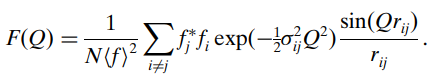
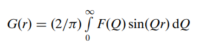

# PDF-calculation-in-reciprocal-space

This R code calculates atomic pair distribution function (PDF) of gold NP in a reciprocal space as described in ref. given below. First, it calculates F(Q):

Then, by fourier transformation, we can calculate G(r):

For more information, please read this:
Farrow, C. L., & Billinge, S. J. L. (2009). Relationship between the atomic pair distribution function and small-angle scattering: implications for modeling of nanoparticles. Acta Crystallographica Section A Foundations of Crystallography, 65(3), 232–239.
